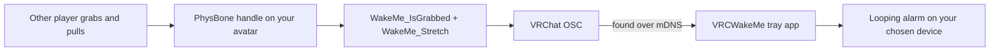

# Design

Four goals shaped it:

| Goal | How |
| --- | --- |
| Nothing to install for the person waking you | They grab the handle on your avatar. No URL, no code, no app on their side. |
| Only someone actually next to you can do it | A grab needs a hand inside the handle's radius in your instance, and it is evaluated on your own client. |
| Safe enough to sleep through | An armed toggle you control, a trigger that needs a grab *and* a pull, a rising edge so holding on cannot retrigger, a cooldown, and a dismiss button. |
| Audible in the headset | You pick the output device and the volume, so the alarm plays where your ears are. |

The chain from their hand to your alarm:

Every wake goes through one entry point in code, `IWakeTrigger.RequestWake(source)`, which OSC calls with `"osc"`. A second source added later reuses the same arming, cooldown and audio rules for free.

Deliberately not in v1: a public website with VRChat sign-in, instance checks or a tunnel; a proximity sphere that arms the handle; Discord webhooks. The app also never writes to the in-game chatbox, by choice.

If an avatar exposes `WakeMe_IsGrabbed` but no `WakeMe_Stretch`, the bare grab wakes you instead, since there is no pull to measure.

## Later

If a remote wake path is ever added, these are the pieces it needs:

1. A public page with VRChat sign-in, for identity and rate limits
2. A same-instance check against the sleeper's reported location
3. An optional 3 m presence sphere that **arms** the website button rather than waking you by itself
4. Friends-only or trust-rank filters
5. A join-instance deep link on the status page

The catch is that a website cannot prove the person clicking is the one standing next to you. Same-instance plus proximity-arming plus per-user limits is the honest ceiling; the avatar grab stays the only real proof of proximity.
